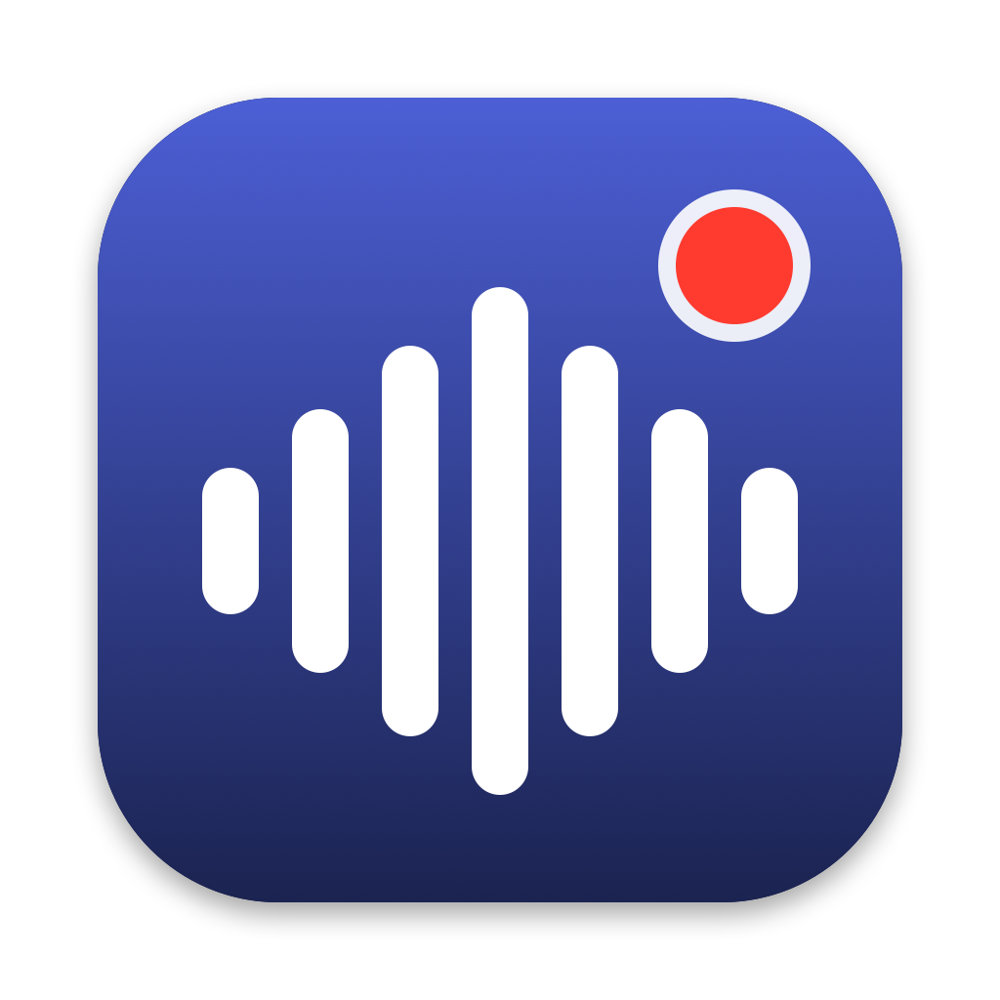
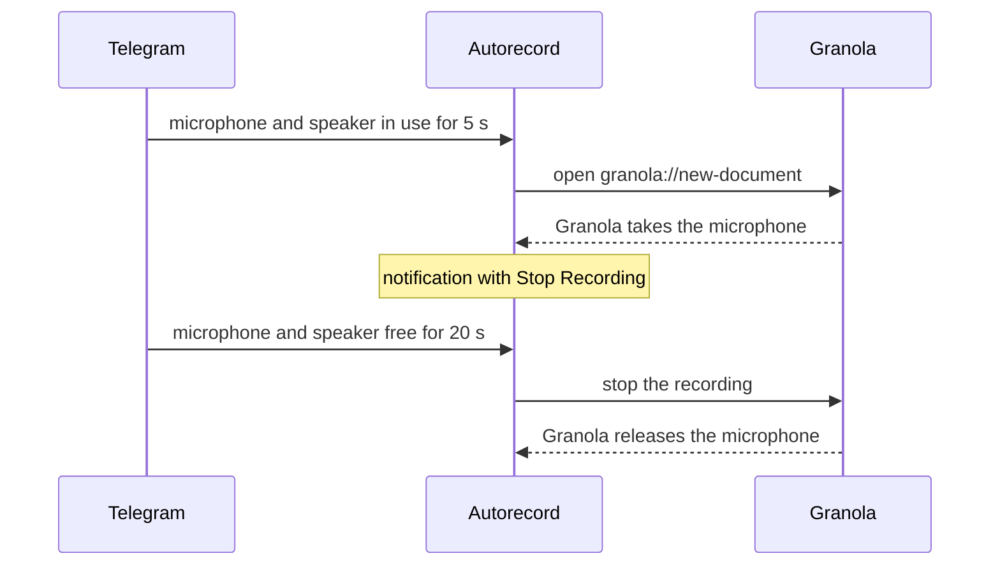

<p align="center">
  
</p>

<h1 align="center">Telegram-Granola Autorecord</h1>

<p align="center">
  Granola records your Zoom, Meet and Teams calls by itself. This makes it record your Telegram calls too.
</p>

<p align="center">
  <a href="https://github.com/leplik/tg-granola-autorecord/actions/workflows/ci.yml"></a>
  <a href="https://github.com/leplik/tg-granola-autorecord/releases/latest"></a>
  
  <a href="LICENSE"></a>
</p>

---

[Granola](https://granola.ai) notices calls in the apps it knows and starts taking notes. Telegram is not one of them, so Telegram calls go unrecorded unless you remember to press the button. Telegram-Granola Autorecord is a small background app that remembers for you:

- **A Telegram call starts:** Granola starts recording, and a notification offers a **Stop Recording** button.
- **The call ends:** the recording stops, and Granola writes the summary as usual.
- **Anything goes wrong:** you get a notification that says what to do.

It works with Telegram Desktop from telegram.org and the Mac App Store, and with the native Telegram for macOS client.

> This is an independent project, not affiliated with Telegram or Granola. Granola has no public API for starting or stopping recordings, so the app relies on undocumented parts of the Granola desktop app. A Granola update can break it; the app tells you when that happens. See [How reliable is this?](#how-reliable-is-this)

## Install

**Homebrew**

```sh
brew install --cask leplik/tap/tg-granola-autorecord
```

**Download**

Get the zip from the [latest release](https://github.com/leplik/tg-granola-autorecord/releases/latest), unzip it and move **Telegram-Granola Autorecord** to Applications. Builds are universal, signed and notarized.

**From source**

```sh
git clone https://github.com/leplik/tg-granola-autorecord.git
cd tg-granola-autorecord
make install
```

Requires macOS 14.4 or later and the [Granola desktop app](https://granola.ai).

## Set up

1. **Open Telegram-Granola Autorecord** from Applications. It adds itself to Login Items and shows a checklist of what is still missing. After that it runs in the background, with no window or menu bar icon. Open it again at any time to see the checklist or turn it off.
2. **Allow notifications.** They carry the Stop Recording button and every warning. If macOS does not ask, use **Open Notification Settings** in the checklist, then check with `tg-granola-autorecord test-notification`.
3. **Allow Accessibility access** in **System Settings → Privacy & Security → Accessibility**. The app needs it to press Granola's stop button when a call ends. Without it, recordings start but do not stop by themselves.

Check everything at once:

```sh
tg-granola-autorecord doctor
```

## How it works



**Detecting calls.** Once a second the app asks macOS which processes use the microphone and the speaker. It needs no permission for this and never touches audio. A call has started when Telegram uses both for five seconds, and is over when it has used neither for twenty.

**Starting.** The app opens `granola://new-document`, Granola's own link for a new note, which starts transcribing straight away. Granola stays in the background.

**Stopping.** Granola has no stop command, so the app tries two routes. First it sends Granola the "meeting ended" message that Granola's Google Meet extension sends, which Granola honours on some accounts. Then it presses Granola's stop button through the Accessibility API. If Granola is still recording after both, you get a notification.

### What happens when…

| Situation | What the app does |
|---|---|
| Granola is already recording, for example a Meet call, when a Telegram call starts | Leaves that recording alone and does not stop it later. |
| You press **Stop Recording** in the notification | Stops the recording and does not start another one until the next call. |
| You stop the recording in Granola yourself | Respects it and stays out of the way until the call ends. |
| Granola stops the recording by itself, for example because of a workspace consent policy | Tells you, and does not work around it. If Granola records again during the call, for example after you confirm consent, the app still stops it when the call ends. |
| Granola briefly drops the microphone, for example when a headset switches profile | Ignores dropouts shorter than 15 seconds. |
| The call drops and reconnects within 20 seconds | Keeps it as one recording. |
| You mute your microphone | Keeps recording while Telegram still plays the other side. |
| You record a voice message | Nothing: only the microphone is in use. |
| Granola is not running | Opens it in the background. |
| Granola takes more than 45 seconds to start recording | Tells you. If the recording starts within three minutes after all, the app still stops it when the call ends. |
| Granola is missing or signed out | Tells you. |
| The recording cannot be stopped | Tells you why, with a button to open Granola or Accessibility settings. |
| The app restarts in the middle of a call, for example during an update | Picks up the recording it started and still stops it when the call ends. A recording it has not seen for over two minutes is left alone. |
| You tap **Stop Recording** on an old notification after a restart | Stops the recording anyway. |

## Configuration

Settings are optional. Create `~/.config/tg-granola-autorecord/config.json` with any of these fields, then run `tg-granola-autorecord restart`.

```json
{
  "startDelaySeconds": 5,
  "endGraceSeconds": 20,
  "notifyOnStart": true
}
```

| Field | Default | Meaning |
|---|---|---|
| `startDelaySeconds` | `5` | How long Telegram must use both microphone and speaker before recording starts. |
| `endGraceSeconds` | `20` | How long both must stay free before the call counts as over. |
| `notifyOnStart` | `true` | Show the notification with the Stop Recording button when a recording starts. |
| `apps` | the three Telegram clients | Bundle identifiers of the clients to watch. |
| `creationSource` | `application_menu` | The `creation_source` sent to Granola for new notes. |

## Command line

Homebrew puts `tg-granola-autorecord` on your `PATH`. For a manual install, the command lives at `/Applications/Telegram-Granola Autorecord.app/Contents/MacOS/tg-granola-autorecord`.

| Command | What it does |
|---|---|
| `doctor` | Checks the setup and prints a report. Paste it into bug reports. |
| `monitor` | Shows live what the call detector sees, without touching Granola. |
| `enable`, `disable` | Turns the app on, or quits it and removes it from Login Items. |
| `restart` | Restarts the app, for example after editing settings. |
| `test-notification` | Sends a notification, to check that notifications are allowed. |
| `start`, `stop` | Starts or stops a Granola recording right now, the way the app would. |
| `ax-dump` | Lists the buttons Granola exposes to Accessibility. Useful after a Granola update. |

## Troubleshooting

Start with `tg-granola-autorecord doctor`. It checks macOS, the app, permissions, Granola, Telegram and your settings, and shows the latest log lines.

- **A call does not start a recording.** Run `tg-granola-autorecord monitor` during a call. It should show `call signal: full`. If it does, check that Granola is signed in and can record on its own.
- **A recording does not stop.** Check Accessibility access. If it is on and Granola was updated recently, run `tg-granola-autorecord ax-dump` during a recording and open a [Granola update issue](https://github.com/leplik/tg-granola-autorecord/issues/new?template=granola_update.yml).
- **Something else started a recording.** Watch `monitor` while it happens and raise `startDelaySeconds` if short sounds trigger it.

The log is at `~/Library/Logs/tg-granola-autorecord.log`. The same lines appear in Console.app under the subsystem `pro.saac.tg-granola-autorecord`.

## Privacy and consent

- **Nothing leaves your Mac.** The app makes no network requests. It only asks macOS which apps use the microphone and the speaker, and never reads audio.
- **Notes are ordinary Granola notes.** They follow the same sharing settings as the rest of your notes. Check your workspace's default sharing before recording private calls.
- **Consent is on you.** Many places require everyone on a call to agree to it being recorded. Tell the people you talk to.

## How reliable is this?

The app depends on four undocumented parts of Granola: the new-note link, the Meet extension socket, a feature flag, and the structure of the stop button. [docs/internals.md](docs/internals.md) describes each one and how to check it again. Each release records the Granola version it was tested with, and `doctor` warns when yours is newer.

When something breaks, the failure is visible: a recording that does not start, or a notification that it could not be stopped. Keep notifications allowed, because they are how the app tells you.

## Uninstall

Turn the app off first, so that it leaves Login Items:

```sh
tg-granola-autorecord disable
brew uninstall --cask --zap tg-granola-autorecord
```

For a manual install, run the same `disable` command, or open the app and choose **Turn Off**, then delete the app. Remove its entry from **Accessibility** in System Settings by hand.

## Contributing

Issues and pull requests are welcome, see [CONTRIBUTING.md](CONTRIBUTING.md). Report security problems privately, see [SECURITY.md](SECURITY.md).

## License

[MIT](LICENSE). Telegram and Granola are trademarks of their respective owners.
